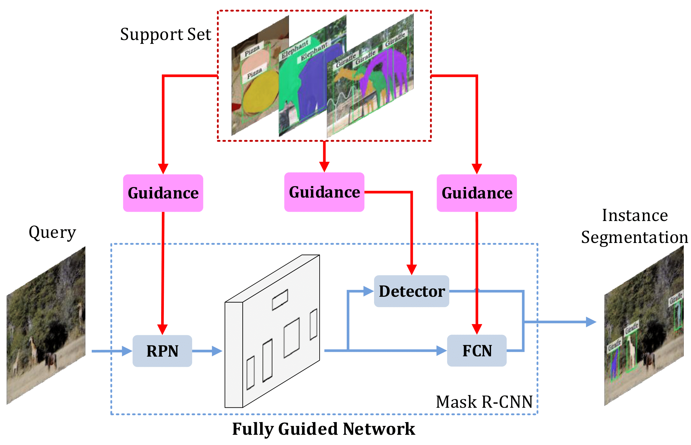

## FGN
Implementation of the **FGN: Fully Guided Network for Few-Shot Instance Segmentation** 

[CVPR FGN](https://openaccess.thecvf.com/content_CVPR_2020/html/Fan_FGN_Fully_Guided_Network_for_Few-Shot_Instance_Segmentation_CVPR_2020_paper) 

[ArXiV FGN](https://arxiv.org/abs/2003.13954)

## Acknowledgements

Work done under the supervision of E.V.Razinkov [razinkov.ai](https://razinkov.ai)

## Main contribution:

- Dataset class for few-shot learning tasks (Object Detection / Instance segmentation)
- FGN training code based on MMDetection framework
- Hyper-parameters validation logs and statistics (`graphs\...`) 
- Models trained in COCO2VOC regime  
    - From scratch (lower than in the article)
    - With DenseCL backbone, i.e. not violating few-shot learning rules (better than in the article)
- VOC instance segmentation dataset with annotation errors description and examples
- Few-shot novel classes dataset collection script (N **instances (not images)**  of K classes from an arbitrary dataset)

## Disclaimer

- Best models (Scratch & DenseCL) are ready but not uploaded yet
- Please, request models in `Issues`, if you are interested
- Graphs translation from Russian to English will come soon
- Repository will be maintained, fell free to ask
- Overview is going to be published in the nearest future 
- Project structure may seem complicated

## Main settings

- Single server for training models with SSH connection
    - Same project structure on the notebook PC and server
    - Same environments on the notebook PC (Win10) and server (Ubuntu 20.04)
    - Notebook PC settings - NVIDIA #470 driver and CUDA 11.1
    - Server settings CUDA - NVIDIA #460 driver and CUDA 11.2
    - Both machines run torch1.9.0+cu111 and torchvision 0.10.0+cu111
- Code
    - No big annotations in code but in text
    - Less grammar but cleaner code
    - Refactoring only after the push
    - Try to use full Git functionality

Common abbreviations and name conventions in code:

- OST - one-shot, not OS to omit it
- FST - few-shot, in similarity to one-shot
- IS - instance segmentation
- img and imgs, not image and images
- sp - short path to the file / folder
- fp - full path to the file / folder
- dir - directory instead of folder everywhere
- ds - dataset
- dl - dataloader
- datasets: MNISTISEG, OMNIISEG, FewShotISEG, where ISEG - instance segmentation
- Pycharm, not PyCharm! Folders locally are named as PycharmProjects
- using train, val (not valid, since valid is less frequent), test subset names
- bbox and bboxes (no boxes), isegmap and isegmaps (no segmaps, cause instance)
- no labels, use cat_id (category id) since a label is for image classification
- no coords, use bboxes
- no confs, use scores
- use a standard Python packaging system with __init__ in each folder
- finetune and finetuning are without dash
- not classes but categories (class is a keyword)
- cat is a category, not an animal
- file_sp of file_fp but not file_name
- Use YXYX in dataset but convert to XYXY for mmdet since image shape is fed
- During TODO tasks completion it is better to commit after every step, every change

Project structure:

- cp_utils (cross-project utils)
    - code to handle time logging and measurements
    - code to handle folders/files creation/removal ops
- datasets (data generation code and generated data itself)
    - mnistiseg
        - tests
        - image samples
    - omniiseg
        - tests
        - images samples
    - fewshotiseg
        - universal Dataset to load mnistiseg, omniiseg, VOC and COCO
        - both single stage and finetuning stage code
        - tests
        - image samples, visualization
        - define single stage classes and second stage classes
    - voc
        - find out how to compute the instance segmentation masks
        - prepare an annotation file to load fast with a predefined format
    - coco
        - prepare an annotation file to load fast with a predefined format
- nets
    - frcnn_pt - Faster R-CNN from PyTorch hub
    - mrcnn_pt - Mask R-CNN from PyTorch hub
    - frcnn - own Faster R-CNN written from scratch
    - fgn - own Fully Guided Network written from scratch
    - frcnn_mmdet - Faster R-CNN from the MMDet
    - mrcnn_mmder - Mask R-CNN from the MMDet
    - fgn_mmdet - FGN on the basis of the MMDet code
- notebooks - general notebooks appropriate for the whole project
- resources - images (e.g. for this README), some data but not large datasets like COCO or VOC
- subprojects
    - task is defined easily from the dataset and net naming, but may be miscellaneous
- subprojects/sp00_mnistiseg_frcnn_pt - Faster R-CNN for MNISTISEG
- subprojects/sp01_mnistiseg_frcnn - custom Faster R-CNN for MNISTISEG
    - config files
    - models and training logs
    - image examples of recognition
- subprojects/sp02_omniiseg_fgn_mmdet - FGN implementation

Evaluation and demonstration settings:

- No augmentation of qry_img
- No augmentation of spp_img
- Randomness in cat_insts_chosen choice has to be stabilized with a full test
  over qry_children, otherwise choose a definite (non-random) set of cat_insts_chosen
- To show results, feed random attributes values which were chosen during sampling, including
  cats_to_sample (with order after a possible shuffle)
- Evaluation has to be performed several times with chosen categories shuffle
  to ensure a random order does not break things
- Selecting sampling_scenario is more complicated,

    - for parents:
        - (+) unique images every time
        - (+) faster speed
        - (-) no same images, recognition of different set of categories on the same
          image does not influence on metric

    - for children:
        - (+) more stable because is tested in more different scenarios
        - (-) may be too long, since a set of children may be very big

- When testing, D-novel is divided into 2 subsets, one with images selected for
  finetuning and second with all other images. During testing all support images
  have to be selected from the first group only. For better understanding, testing
  has to be performed on three groups: first with support images (~test on train),
  second (~test on test), union set.
  
